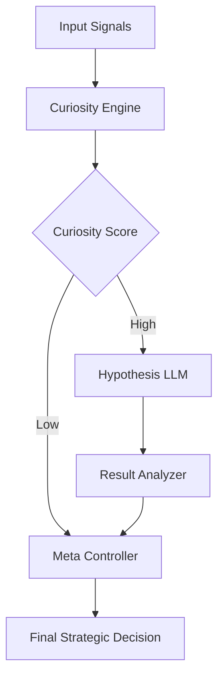

# NEXTMIND: Autonomous Reasoning AI System

## Overview

NEXTMIND is a research-oriented backend architecture designed to explore autonomous cognitive pipelines. Unlike traditional reactive AI systems that rely solely on direct user prompting, NEXTMIND implements a cyclical reasoning model driven by internal state metrics (Curiosity, Uncertainty, and Novelty).

The system operates continuously to formulate hypotheses, evaluate internal logic, and adjust its exploration strategy without external dependencies. This project serves as a foundational prototype for local-first, autonomous machine intelligence.

## System Architecture

The core architecture follows a robust Domain-Driven Design (DDD) approach, ensuring separation of concerns between signal processing, semantic reasoning, and meta-cognitive control.

### High-Level Data Flow

1.  **Signal Acquisition**: The system ingests abstract numerical vectors representing environmental states.
2.  **Curiosity Engine**: Computes normalized scores for `Uncertainty` and `Novelty` to determine the necessity of investigation.
3.  **Use Case Analysis**: A local Large Language Model (LLM) — specifically quantized `TinyLlama-1.1B` — generates a natural language hypothesis based on the curiosity score.
4.  **Meta-Controller**: Evaluates the hypothesis against historical success rates to make a binary strategic decision (Explore vs. Exploit).
5.  **Feedback Loop**: Results are analyzed and fed back into the dashboard for real-time visualization.



## Repository Structure

The codebase is organized to support modularity and scalability:

```text
NEXTMIND/
|-- api/                # FastAPI application endpoints
|-- core/               # Core business logic and cognitive modules
|   |-- analysis/       # Evaluation logic for hypothesis verification
|   |-- curiosity/      # Mathematical models for internal drive states
|   |-- llm/            # Wrappers for local LLM inference (llama.cpp)
|   |-- meta/           # High-level decision making controllers
|   |-- pipeline.py     # Central orchestration service
|-- demo/               # Frontend visualization simulation (TypeScript/Vite)
|-- models/             # Quantized GGUF model storage (ignored in git)
|-- dashboard.py        # Streamlit-based interactive control panel
|-- requirements.txt    # Python dependency manifest
```

## Technical Implementation Details

### Cognitive Pipeline
The `NextMindPipeline` class orchestrates the execution flow. It utilizes Dependency Injection to manage the lifecycle of sub-components, ensuring that the heavy LLM weights are loaded only once during initialization.

### Local Inference
To ensure data privacy and low latency, NEXTMIND utilizes `llama.cpp` through Python bindings.
*   **Model**: TinyLlama-1.1B (Chat v1.0)
*   **Format**: GGUF (4-bit Quantization)
*   **Hardware Requirement**: Standard CPU (No GPU required)

### Curiosity Algorithms
The curiosity score is derived using a weighted heuristic:
*   `Score = (Uncertainty * 0.7) + (Novelty * 0.3)`
*   This specific weighting prioritizes epistemic uncertainty (lack of knowledge) over aleatoric uncertainty (randomness).

## Installation and Usage

### Prerequisites
*   Python 3.10+
*   Git

### Setup

1.  **Clone the Repository**
    ```bash
    git clone https://github.com/thesakshidiggikar/NEXTMIND-Autonomous-Reasoning-AI-System.git
    cd NEXTMIND
    ```

2.  **Install Dependencies**
    ```bash
    pip install -r requirements.txt
    ```

3.  **Run the Dashboard**
    The primary interface is a Streamlit dashboard that visualizes the internal state in real-time.
    ```bash
    streamlit run dashboard.py
    ```

## Development

### Backend API
A lightweight REST API is available for headless execution.
```bash
uvicorn api.main:app --reload
```

### Static Analysis
Type hints are enforced throughout the codebase. Run `mypy` to verify type safety:
```bash
mypy core/
```

## License

This project is intended for educational and research purposes.
